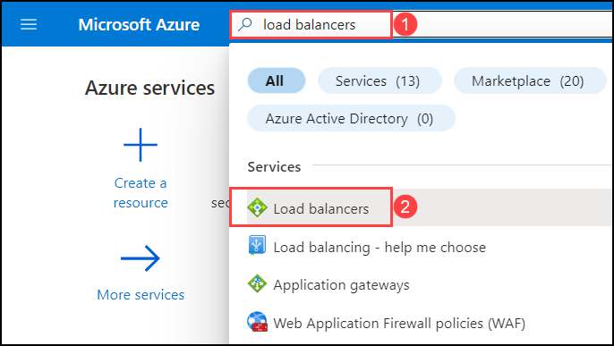

# Exercise 4: Setup Load Balancing

## Scenario

Contoso Insurance application has been tested and validated by internal users. Now, Contoso wants their application to be available for beta users for testing. Contoso needs to distribute its application traffic across servers and also want its application to be highly available. They also want to control the system failures with zero downtime. 

You will help Contoso to build a highly available solution by creating an Azure Load balancer that distributes the load across servers evenly and will also be able to handle the load in case of system failures.


## Overview

Azure load balancer allows you to distribute traffic to your backend virtual machines. An Azure load balancer provides high availability for your application. The Azure load balancer is a fully managed service itself. With Azure Load Balancer, you can scale your applications and create highly available services. A Load balancer provides low latency and high throughout, and scales up to millions of flows for all TCP and UDP applications. To learn more about Load balancer refer: ```https://docs.microsoft.com/en-us/azure/load-balancer/```


In this exercise, you will provision a secondary Virtual Machine with the Contoso Insurance application hosted on it. You will deploy an External Load balancer, add virtual machines to the backend pool, and test the load balancing between them. You will also test the behavior of the Load Balancer in case of VM failover.


* [Task 1: Provision Secondary VM](#task-1-provision-secondary-vm)
       
* [Task 2: Provision Load Balancing using External Load Balancer](#task-2-setup-load-balancing-using-external-load-balancer)
       
* [Task 3: Test LB & VM failover](#task-3--test-lb--vm-failover)

 
## Task 1: Provision Secondary VM
 
In this task, you will deploy secondary a Virtual Machine using a pre-built ARM template
    
1. Copy and paste the below **Link** in the new tab of your browser and launch the template deployment. Log in to the Azure portal using your user credentials if you are prompted to do so.

    ```
    https://portal.azure.com/#create/Microsoft.Template/uri/https%3A%2F%2Fraw.githubusercontent.com%2FCloudLabsAI-Azure%2FAIW-Azure-Network-Solutions%2Fmain%2Ftemplate%2Fcontoso-iaas2-region1.json
   ```
 
1. On the **Custom deployment** basics tab enter the following values to deploy the template.

    - Resource group : **<inject key="Resource Group" enableCopy="false"/> (1)**

    - Click on **Review + create (2)**

      
        
1. Review the configuration and click on **Create**.

   > **Note**: The template will take up to 15 minutes to deploy.
  
    
    
1. While you wait for the resources to deploy, take some time to review the template contents. Navigate to **Template (1)** and observe the **Resources (2)** which are deploying.
 
   > The template is designed to deploy a virtual machine in the Availability zone for high availability.
     
   
     
## Task 2: Setup Load Balancing using External Load Balancer 

In the previous task, you have provisioned a secondary virtual machine. In this task, you will create an external load balancer and place the virtual machine in the backend pool and configure load balancing rules.
    
1. From the Azure Portal menu, type for **Load balancers** and select it.

   
  
1. Click on **Create load balancer**.

   
     
1. On the Load balancer page, under the **basic** tab enter the following details:

     - Resource Group : Select **<inject key="Resource Group" enableCopy="false"/> (1)**

     - Name  : Enter  **<inject key="Loadbalancer" enableCopy="true"/> (2)**

     - Type  : Select **Public (3)**

     - Click on **Next: Frontend IP Configuration (4)**.

       
        
1.  On the **Frontend IP Configuration** tab, click on **+ Add a frontend IP**.

    
       
1.  On **Add frontend IP adress** tab, enter the following details:

     - Name : Enter **<inject key="Ipname" enableCopy="true"/> (1)**

     - Under **Public IP address** click on **Create new (2)**
      
     - Now add **Name** as **pip-contosolbe-prod-eastus-001 (3)** 
      
     - click on **Ok (4)**.

       
       
1. Under **Add frontend IP Address**, review the **Name (1)** and **Public IP address (2)** and click on **Add (3)**.

    
    
1. After adding the frontend IP Address, observe that the **frontend IP configuration (1)** is listed and click on **Next: Backend Pool (2)**.

    
  
1. On the **Backend pools** tab click on **+ Add a backend pool**.

    
    
1. Enter the below details to create **Backend Pool**.

     - **Name** : Enter **<inject key="Backendpoolname" enableCopy="true"/> (1)**

     - **Virtual Network** : Select the VNet **<inject key="VnetName" enableCopy="false"/> (2)** from drop down list

     -  Under **Virtual machines** select **+ Add (3)**.

      
      
 1. Now to add the virtual machines in the backend pool, select both the VMs **(1)** and click on **Add (2)**.

     
     
 1. Click on **Add** once again.

     
      
1. On the **Backed pools** tab, observe the newly added backend pool configurations listed **(1)** and click on **Next: Inbound rules (2)**.

    
     
1. To create a load balancing rule, on the **Inbound rules** tab click on **+ Add a load balancing rule**.

    

1. On **Add a load balancing rule** page enter the below details:

     - Name : **<inject key="Loadbalancer Rule" enableCopy="true"/> (1)**

     - Frontend IP address : **<inject key="Ipname" enableCopy="false"/> (2)** from drop down list.

     - Port : **80 (3)**

     - Backend Port : **80 (4)**

     - Backend Pool : Select **<inject key="Backendpoolname" enableCopy="false"/> (5)** from drop down list.

       
     
     - Health Probe: To create health probe click on **create new (1)** and follow the below instructions:
      
       - **Name** : **<inject key="HealthProbe" enableCopy="true"/>** **(2)**
      
       - **Protocol** : **HTTP** **(3)**
        
       - select **Ok** **(4)**

        
       
      - TCP reset: **Enabled (1)**

      - Select **Add (2)**
      
        

1. After adding the Load balancing rule click on **Review + create** and select **Create**.

    
      
1. After the deployment of the load balancer is successful, select **Go to the resource**.

   
      
##  Task 3 : Test LB & VM failover.

In this task, you will test the Load balancing and Virtual machine failover.
    
1.  On the **Load balancer** overview page copy the **Public IP address** of the load balancer.

    

1. Open the new browser tab and paste the IP address in the address bar and hit **Enter**. The custom VM page of the Web server will be displayed in the browser. You can observe from which virtual machine the request has been served. For example, in this scenario the request was served by **<inject key="VM1Name" enableCopy="false"/>**.

     

1. Refresh the page several times, and notice how the hostname changes between two virtual machine instances regularly.
     
1. To test for VM failover, navigate back to resource group **<inject key="Resource Group" enableCopy="false"/>** and select **<inject key="VM1Name" enableCopy="false"/>**.

1. On the Virtual machine page, deallocate the VM by clicking on **Stop.**

   

1. Navigate back to the browser where you accessed the public IP address and refresh the page. As you have deallocated the **<inject key="VM1Name" enableCopy="false"/>**, you will be able to observe that the request is only served by the currently running virtual machine **<inject key="VM2Name" enableCopy="false"/>**.

    
    
1. Now, navigate back to the deallocated virtual machine and **Start** it.

## Summary

In this exercise you have covered the following:

- Provisioned Secondary VM

- Created and configured Load Balancer

- Tested Load Balancing and Virtual Machine failover


